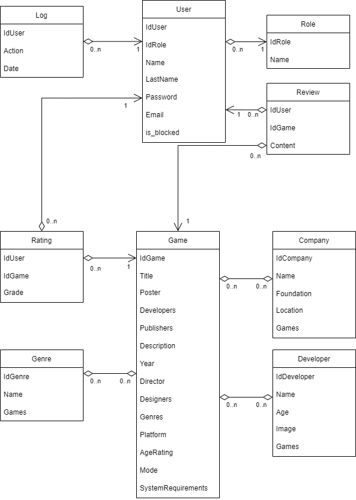
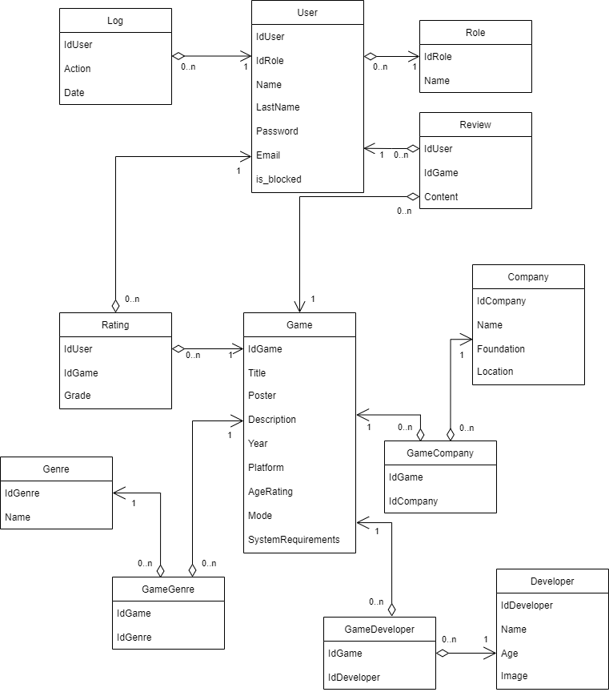

## Requirements:
1. Users:
   * default
   * moderator
   * admin
2. Default user:
   * Authentification
   * Leave review
   * Rate the game
3. Moderator:
   * create, edit and delete game page
   * Delete reviews
4. Admin:
   * the same as moderator + block user
---
Scheme:

---
DB description

**Highlited** fields are primary key
1. Users - users who use the app
   * **IdUser** - uuid
   * IdRole - uuid(foreign key)
   * Name - varchar(30 user name)
   * LastName - varchar(30 user last name)
   * Password - varchar(64 user password)
   * Email - varchar(128 user email)
   * is_blocked - bool(is banned user or not)
2. Role - role for users
   * **IdRole** - uuid
   * Name - varchar(30 role name)
3. Log - logs for users action
   * **IdUser** - uuid(foreign key)
   * Action - varchar(128 user action)
   * Date - time(time of action)
4. Review - game review
   * **IdUser** - uuid(foreign key)
   * **IdGame** - uuid(foreign key)
   * Content - varchar(review content)
5. Rating - game score
   * **IdUser** - uuid(foreign key)
   * **IdGame** - uuid(foreign key)
   * Grade - int(game score from 1 to 10)
6. Genre - game genre
   * **IdGenre** - uuid
   * Name - varchar(30 genre name)
7. GameGenre - many to many table
   * **IdGame** - uuid(foreign key)
   * **IdGenre** - uuid(foreign key)
8. Company - company who develop and publish games
   * **IdCompany** - uuid
   * Name - varchar(64 company name)
   * Foundation - time(company foundation date)
   * Location - varchar(30 company location)
9. GameCompany - many to many table
   * **IdGame** - uuid(foreign key)
   * **IdCompany** - uuid(foreign key)
10. Developer - person who develop the game
    * **IdDeveloper** - uuid
    * Name - varchar(64 developer name)
    * Age - int(developer age)
    * Image - varchar(256 developer image path)
11. GameDeveloper - many to many table
    * **IdGame** - uuid(foreign key)
    * **IdDeveloper** - uuid(foreign key)
12. Game
    * **IdGame** - uuid
    * Title - varchar(64 game title)
    * Poster - varchar(256 game poser image path)
    * Description - varchar(512 game description)
    * Year - time(game release year)
    * Platform - varchar(64 game platform)
    * AgeRating - varchar(16 game age rating)
    * Mode - varchar(64 game mode)
    * SystemRequirements - varchar(256 game system requirements)
---
DB NF Scheme:

